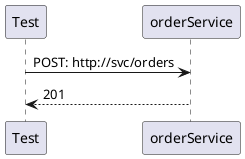

# Diagrammed Test Run Summary

| Metric | Value |
|---|---|
| Status | ✅ Passed |
| Scenarios | 1 |
| Passed | 1 |
| Failed | 0 |
| Skipped | 0 |
| Duration | 1m 5s |

## Sequence Diagrams

✅ <strong>Checkout — Places an order</strong>

Sequence Diagram - PlantUML

